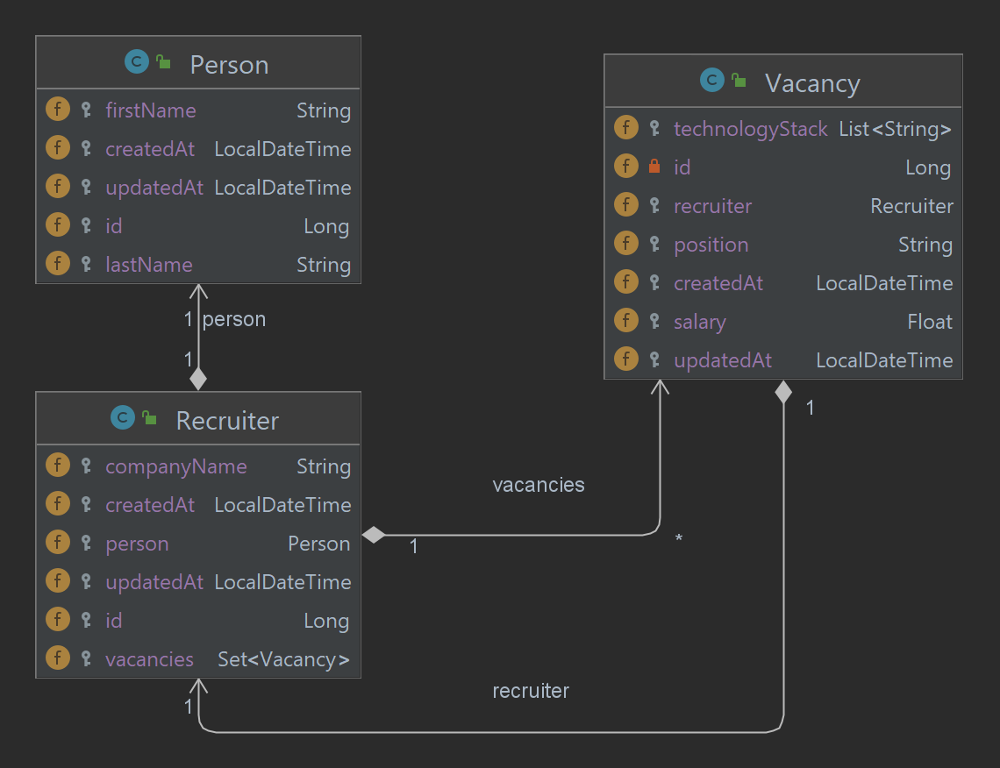

# Spring Boot and REST API

## Description

This Spring Boot application serves as a backend service for storing and managing data related to recruiters and job
vacancies. Leveraging a PostgreSQL database, it offers REST API endpoints for efficient interaction with the entities.



## Technologies

- Java 17
- Spring Boot 3.2.5 (with Spring Web, Spring Data JPA, Spring Validation)
- PostgreSQL 16
- Maven 4.0.0
- Docker
- Liquibase
- Apache POI

## Installation

1. Clone the repository
2. Navigate to the project directory
3. Use the docker-compose file to start Spring Boot application and the PostgreSQL database
   ```shell
   docker-compose up -d
   ```
4. Access the application at `http://localhost:8080`

## Usage

The application provides the following REST API endpoints:

| Method | Endpoint                  | Description                                    | Example field in request body                                                                                   |
|--------|---------------------------|------------------------------------------------|-----------------------------------------------------------------------------------------------------------------|
| GET    | `/api/v1/recruiter/{id}`  | Return details of a recruiter by ID            |                                                                                                                 |
| POST   | `/api/v1/recruiter`       | Create a new recruiter                         | `firstName: Vladyslav`,<br/> `lastName: Bondar`,<br/> `company: ProfItSoft`                                     |
| PUT    | `/api/v1/recruiter/{id}`  | Update a recruiter by ID                       | `company: ProfItSoft`                                                                                           |
| DELETE | `/api/v1/recruiter/{id}`  | Delete a recruiter by ID                       |                                                                                                                 |
| GET    | `/api/v1/vacancy/{id}`    | Return details of a vacancy by ID              |                                                                                                                 |
| POST   | `/api/v1/vacancy`         | Create a new vacancy                           | `position: Java Developer`,<br/> `salary: 3000`,<br/> `technologyStack: [Java, Spring]`, <br/> `recruiterId: 1` |
| PUT    | `/api/v1/vacancy/{id}`    | Update a vacancy by ID                         | `salary: 3500`                                                                                                  |
| DELETE | `/api/v1/vacancy/{id}`    | Delete a vacancy by ID                         |                                                                                                                 |
| POST   | `/api/v1/vacancy/_list`   | Return a list of vacancies by a filter         | `technologyStack: [Java, Spring]`                                                                               |
| POST   | `/api/v1/vacancy/_upload` | Upload vacancies from JSON file                | `file: vacancies.json`                                                                                          |
| POST   | `/api/v1/vacancy/_report` | Generate Excel report of vacancies by a filter | `technologyStack: [Java, Spring]`, </br> `position: Java Developer`, </br> `salary: 3000`                       |

## Testing

### Environment setup

The application includes unit tests for the service layer and integration tests for the REST API endpoints.
Please use testing database from `application-test.yml` for running tests. You can fast create testing database with
Docker compose file `docker-compose-testing.yaml`.

### Enhanced testing endpoints

You can easly test the application using http requests. A few files for testing the application are available in
the `src/test/resources/http-requests` directory. You can use files from this directory in your IDE.